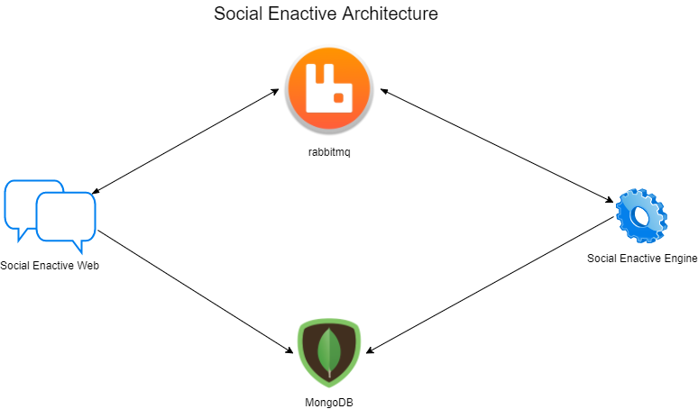

# enactive-system
This is a web chatbot environment for researches and social experiments.
 
Chatbot is a system that tries to mimic a human behavior.
Here we found a research platform to talk and develop new kinds of chatbot templates

# Architecture

# Modules
- Engine
- Web

# Templates Available
- ECHO
- SILENT
- ARTS TEACHER (soon) 

# Production Web
[Try it now!](https://enactive-social-bot.herokuapp.com/)